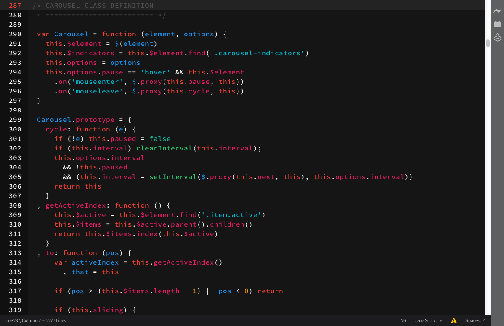
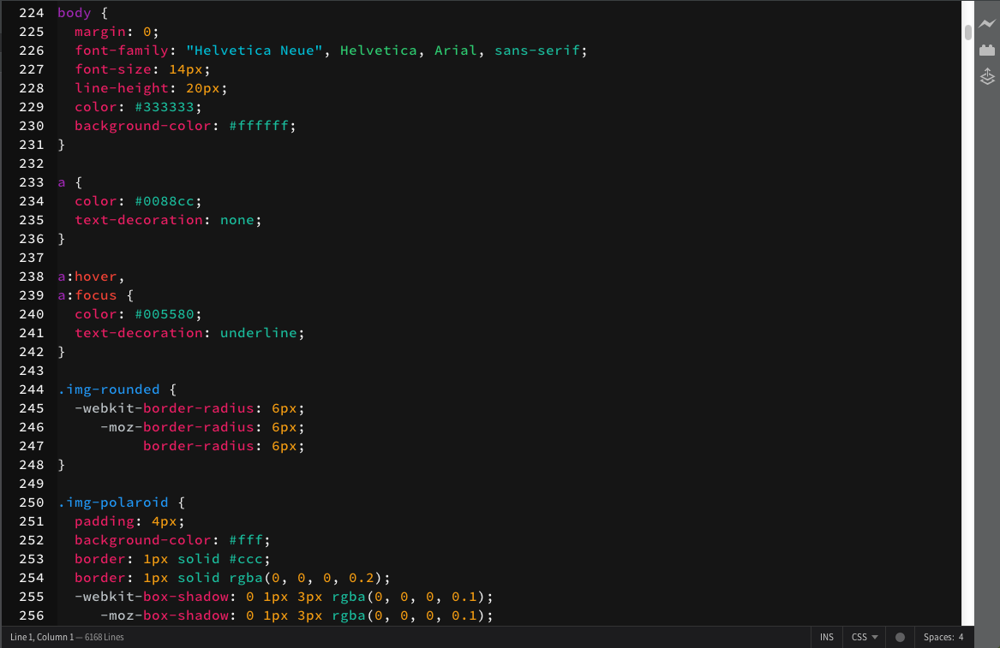
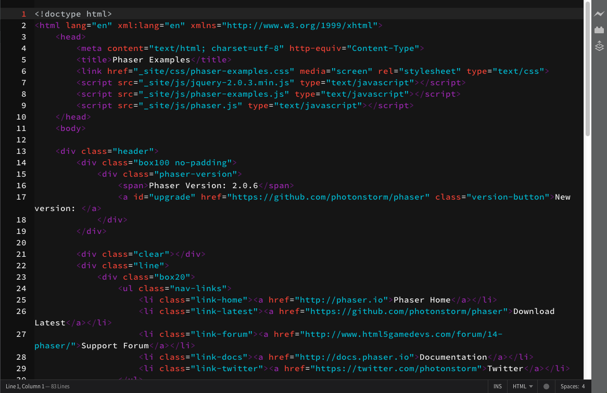

# Brackets Theme: chill

This theme contains a mix of desigmodo's Flat colors and Google's Material Design color palaette.

#Screenshots
### Javascript

### CSS

### HTML

Installation
---

This extension requires Brackets Release 1.0 or newer.
1. Download this theme
2. Open Brackets
3. Click on "Help" and select "Show Extensions Folder"
4. Open the folder "user" 
5. Move the chill to "user"
6. In Brackets, open "Themes" and select chill

